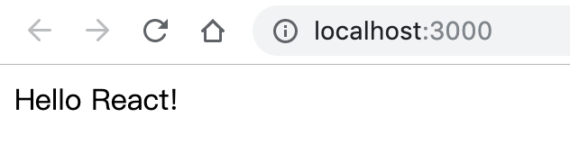

# 项目结构

## 1 最简单的react项目

### 1.1创建第一个组件

```react
// App.js
import React, {Component} from 'react';

/**
 * 应用的根组件
 */

 export default class App extends Component {
     
    render() {
        return <div></div>
    }
 }
```

* 定义组件的两种方式：

  ​	1。 简单的：函数

  ​	2。 复杂的：类

* 如何判断复杂度？

  ​	组件是否有状态

##1.2 创建入口文件

```js
// index.js
/**
 * 入口js
 */
import React from 'react';
import ReactDOM from 'react-dom';

import App from './App';

// 将App组件标签渲染到index页面的div上
ReactDOM.render(<App />, document.getElementById('root'));
```

##1.3 查看index.html

```html
<!DOCTYPE html>
<html lang="en">
  <head>
    <meta charset="utf-8" />
    <link rel="shortcut icon" href="%PUBLIC_URL%/favicon.ico" />
    <meta name="viewport" content="width=device-width, initial-scale=1" />
    <meta name="theme-color" content="#000000" />
   
    <link rel="manifest" href="%PUBLIC_URL%/manifest.json" />
    
    <title>React App</title>
  </head>
  <body>
    <div id="root"></div>
  </body>
</html>
```

执行 npm start 运行项目

这时候，打开的浏览器页面，没有任何内容！

在App.js 的 div标签里，添加内容：

```html
<div>Hello React!</div>
```

保存，查看浏览器：



## 2 项目基本结构

```js
src
> api						// ajax相关
> assets 				// 公用资源
> components 		// 非路由组件
> config 				// 配置
> pages					// 路由组件
> utils					// 工具模块
> App.js				// 应用根组件
> index.js			// 入口js
```

